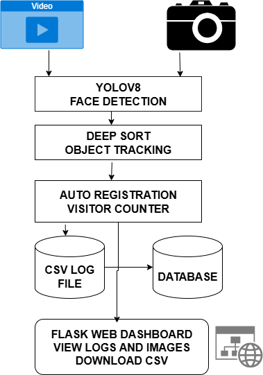

# face-detector
Intelligent Face Tracking and Registration System

Intelligent Face Tracker with Auto-Registration and Visitor Counting

🔧 Setup Instructions

Clone the repository:
git clone https://github.com/yourusername/intelligent-face-tracker.git
cd intelligent-face-tracker

Create a virtual environment:
python -m venv venv
source venv/bin/activate (On Windows: venv\Scripts\activate)

Install dependencies:
pip install -r requirements.txt

Run the project:
python main.py

🧠 Assumptions Made

The system runs on a single webcam input (e.g., laptop camera)

Unknown faces are automatically registered with unique IDs

Captured images and logs are stored locally

YOLO is used for detection, DeepSort for tracking, and InsightFace for recognition

⚙️ Sample config.json

{
"camera_index": 0,
"log_csv_path": "logs/visitors.csv",
"event_log_path": "logs/events.log",
"image_save_path": "static/images",
"database": {
"type": "sqlite",
"path": "visitors.db"
},
"detection_model": "yolov8",
"recognition_model": "insightface"
}

🧱 Architecture Diagram

## 📊 Architecture Diagram

📹 Project Demo Video

Watch on Loom: https://www.loom.com/share/bcca6841f6564087aa6303f23a0dc2af?sid=60afdce0-be9f-46bd-9d0d-262c58c669c9

📁 Sample Output Files

logs/visitors.csv : Visitor name, ID, and timestamp

logs/events.log : System events and logs

static/images/ : Captured images of new/known faces

visitors.db : Visitor details stored in SQLite database

📝 Requirements File (requirements.txt)

opencv-python
flask
insightface
ultralytics
numpy
pandas
scikit-learn
sqlalchemy
deep_sort_realtime

🔚 Credits

This project is a part of a hackathon run by https://katomaran.com
